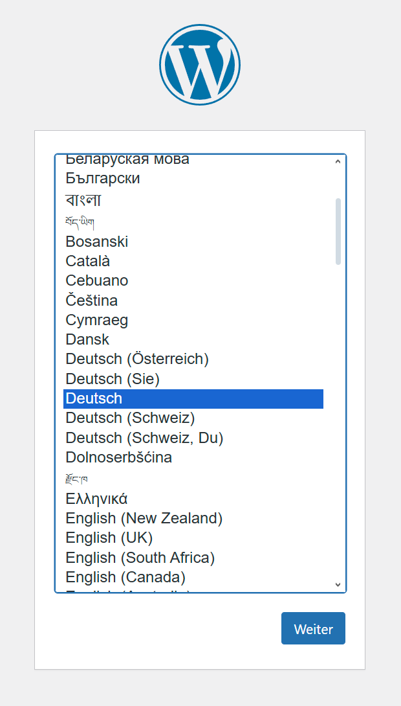
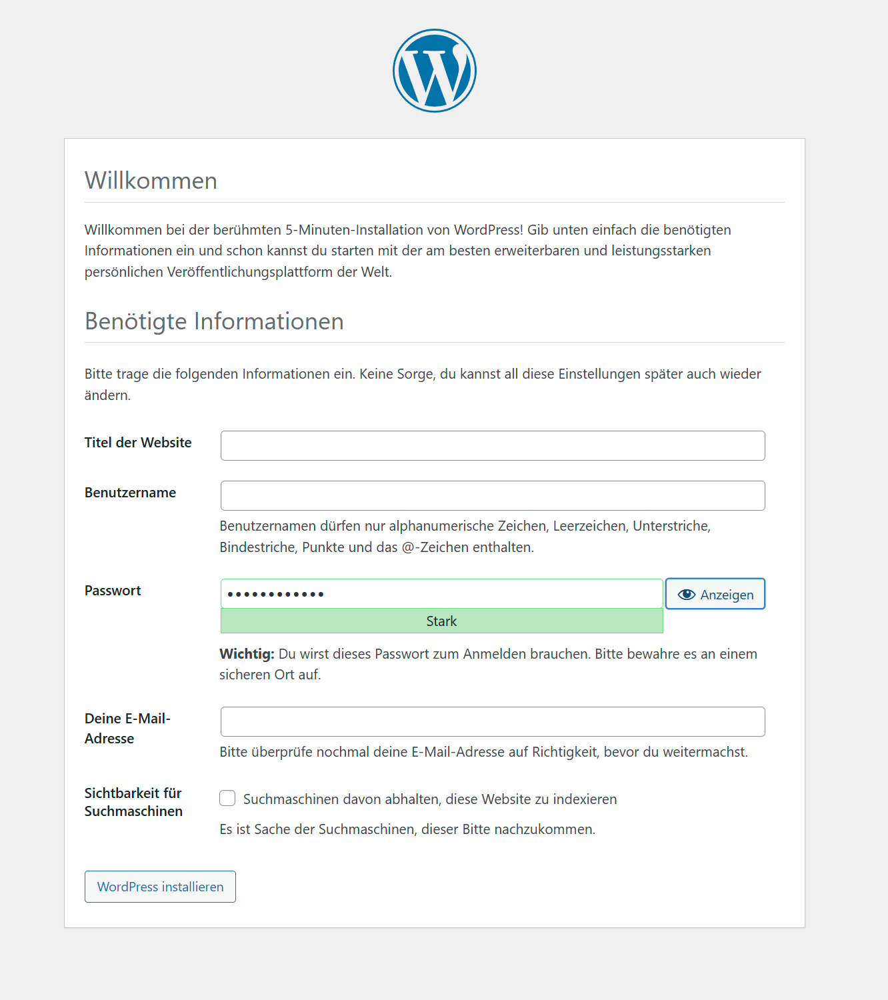
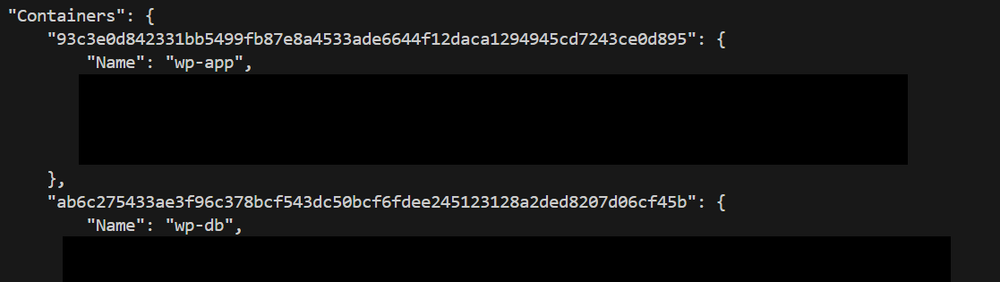

# WordPress_Multi_Container_Setup

This repository serves as a guide for containerizing **WordPress** with **Docker Compose**.  

This repository was created as part of my continuing education at the **Developer Academy**.

## Table of Contents

1. [Prerequisites](#prerequisites)
2. [Description](#description)
3. [Quickstart](#quickstart)
4. [Usage](#usage)


## Prerequisites

  * **Docker**
  * **Compose**

## Description

### Wordpress

[WordPress](https://wordpress.com/de/) is a free, open-source content management system (CMS) that was originally developed for blogs but is now used for all kinds of websites. It offers a user-friendly interface and can be flexibly customized and expanded with themes and plugins.

### WordPress with Docker

[Docker](https://hub.docker.com/_/wordpress) offers the option of containerizing WordPress with a compose.yml. The setup shows that you need two containers for this, one for the WordPress application and one for the database.

* The compose.yml file uses the WordPress base image, which already contains 
  * a lean operating system
  * Apache (web server)
  * PHP (including the extensions required for WordPress)
  * WordPress files


* A MySQL or **MariaDB** instance is recommended for the database container. <br/>
  MariaDB is used in this repository. <br/>
  In addition to the required operating system, the base image contains:
  * MariaDB server
  * Basic configurations required for operation


### Folder structure 
```
wordpress_multi_container_setup/
    ├── compose.yml
    ├── example.env
    └── README.md
```

## Quickstart

This section gives brief and minimal instructions on how to use the setup. More in-depth instructions can be found in the [Usage](#usage) section.

1. Clone the project to your platform:

   ```bash
   git clone git@github.com:cyborg-s/wordpress_multi_container_setup.git
   ```

1b. Navigate to the project directory:

   ```bash
   cd wordpress_multi_container_setup
   ```

2. Create the `.env` file from the template and edit your own settings:
   
   ```bash 
   cp example.env .env
   ``` 

   ```bash
   nano .env
   ```

3. Build and start the container in the background:

   ```bash
   docker compose up --build -d
   ```


4. Check whether the server is running correctly:

    * WordPress can be accessed at the IP address of your VM on port 8080:

      ```bash  
      http://<Your_VM_IP>:8080
      ```  

    * When you open the page, you will be redirected to the installation page and can now start creating your account. After setup, a sample blog page will be displayed.
  
    

    

## Usage

* Navigate to the project directory:

   ```bash
   cd wordpress_multi_container_setup
   ```


* Manage the container:
  
  * show the log files:
    ```bash
    docker compose logs -f
    ```

  * stop the container:
    ```bash
    docker compose stop <CONTAINER_NAME>
    ```

  * delete the container:
    ```bash
    docker compose down <CONTAINER_NAME>
    ```

  * list all containers that are operatet by Docker Compose:
    ```bash
    docker compose ps
    ```

*  If no network is defined in the compose file, docker automatically creates one. 
   *  To check which networks exist:

        ```bash
        docker network ls
        ```

    * To list which containers are on a network:

        ```bash
        docker network inspect <network-name>
        ```

    * To check if the wordpress and mariadb container are in the same network:

        ```bash
        docker network inspect wordpress_multi_container_setup_default
        ```  

    
